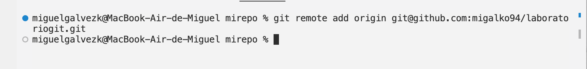

# **Laboratorio de Git**

## **Objetivos**
***

> Aquí describo la realización de los objetivos

### **1. Crear un repositorio en local**
---

- Abre tu terminal y navega hasta el directorio donde deseas crear el repositorio **+** Crea una carpeta con el nombre del repositorio:

    Aquí se reflejan ambos pasos:

- Ingresa a la carpeta que acabas de crear:

- Inicializa el repositorio de Git:

- **Extra solución problema con .DS_Store:**

Surgió el problema del fichero *.DS_Store* que no queremos y lo solucionamos con *.gitignore*:

Comprobamos:

- Stage y commit del README.md:

Hacemos stage y commit del README.md:

### **2. Subir el repositorio a GitHub**
---

*Previamente hice modificaciones en el formato del README.md*

- Crea un nuevo repositorio en GitHub:

- Copia el URL del repositorio que acabas de crear en GitHub:

- Conecta tu repositorio local con el repositorio en GitHub:

- Verifica que la conexión se haya establecido correctamente:

### **3. Hacer un commit y un push**
---

- Crear un archivo en la carpeta del repositorio:

- Añade el archivo al staging:

- Crea un commit con un mensaje descriptivo:

- Sube los cambios al repositorio en GitHub:

*Hago más modificaciones de formato en README.md*

### **4. Crear una rama**
***

- Crea una rama nueva llamada "development":

- Cambia a la nueva rama:

- Realiza algunos cambios en el archivo que creaste:

- Añade y haz un commit con los cambios en la rama "development":

- Sube los cambios a GitHub:

## **5. Hacer un merge**
***

*La rama principal de nuestro repositorio puede ser "main" o "master" según la hayamos nombrado*

- Vuelve a la rama "main":

En nuestro caso, "master"

- Haz un merge de la rama "development" a la rama "main":

En nuestro caso, "master"

Según hemos investigado, en este caso, introdujimos innecesariamente un mensaje commit cuando el merge era fast-forward, lo que llevó al mensaje que nos mandó Git.

- Si no hay conflictos, los cambios realizados en la rama "development" se incorporarán a la rama "main" **+** - Haz un push de los cambios al repositorio en GitHub

Los cambios se incorporan sin conflictos

*Realizamos los últimos retoques en el formato del README.md*

> Fin del laboratorio